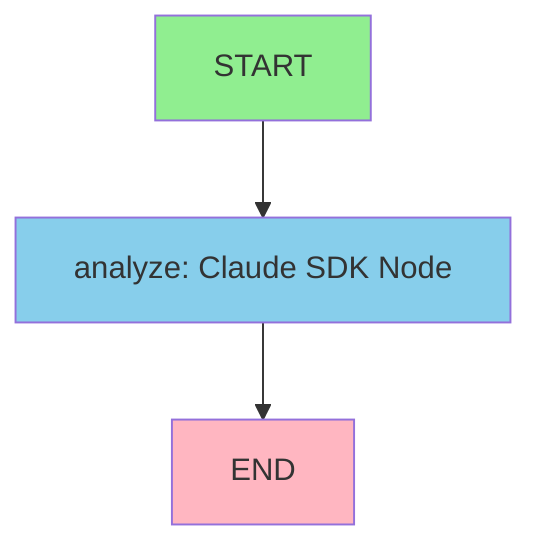

# LangGraph Markdown Analyzer - Claude SDK Agent

A dockerized LangGraph application with a single node powered by Claude SDK that analyzes markdown files and provides intelligent summaries. This agent runs in an isolated container using AWS Bedrock authentication.

## Architecture

This application uses **LangGraph** to orchestrate a simple workflow:

```
START → [Claude SDK Analyzer Node] → END
```

The single node uses Claude SDK with access to file reading tools (Read, Glob, Grep) to analyze markdown files.

### LangGraph State Flow



**State Structure:**
- `file_path`: Path to the markdown file to analyze
- `file_content`: Optional file content
- `summary`: Generated summary (2-3 sentences)
- `analysis`: Full analysis with key topics, structure, patterns
- `error`: Error message if any
- `status`: Current status (pending/completed/error)

## Features

### LangGraph Workflow
- ✅ **Single Node Architecture**: One Claude SDK-powered analyzer node
- ✅ **State Management**: Structured state with TypedDict
- ✅ **Graph Visualization**: Auto-generated workflow diagram
- ✅ **Async Execution**: Full async/await support

### Analysis Capabilities
- 📄 **Summary Generation**: Concise 2-3 sentence summaries
- 🎯 **Topic Extraction**: Identifies key themes and topics
- 📊 **Structure Analysis**: Analyzes headings and document organization
- 🔍 **Pattern Detection**: Finds notable patterns and issues
- 💾 **Result Persistence**: Save analysis to files

### Infrastructure
- 🐳 **Dockerized**: Isolated container environment
- ☁️ **AWS Bedrock**: Uses AWS credentials (no API keys needed)
- 🔒 **Secure**: Non-root user execution
- 📝 **Logging**: Complete session logs

## Prerequisites

### 1. AWS Bedrock Access

```bash
# Verify AWS credentials
aws sts get-caller-identity

# Check Bedrock access
aws bedrock list-foundation-models --region us-east-1
```

### 2. Docker Setup

```bash
# Install Docker
curl -fsSL https://get.docker.com | sh

# Verify
docker --version
docker compose version
```

### 3. Directory Structure

```
langgraph-md-analyzer/
├── md_analyzer_agent.py    # LangGraph + Claude SDK agent
├── bedrock.py              # AWS Bedrock token generator
├── entrypoint.sh           # Container initialization
├── Dockerfile              # Container definition
├── docker-compose.yml      # Docker orchestration
├── requirements.txt        # Python dependencies
├── config/
│   └── settings.json       # Claude permissions
├── files/                  # Place markdown files here
├── logs/                   # Analysis outputs + graph visualization
└── README.md              # This file
```

## Installation

### Step 1: Navigate to Project

```bash
cd langgraph-md-analyzer
```

### Step 2: Verify AWS Credentials

```bash
ls -la ~/.aws/
# Should show: config, credentials
```

### Step 3: Build Docker Image

```bash
docker compose build
```

This installs:
- Node.js 20 + Claude Code CLI
- Python 3 with LangGraph, Claude SDK
- AWS CLI + boto3/botocore
- GraphViz for visualization

## Usage

### Interactive Mode (Recommended)

```bash
docker compose run --rm analyzer
```

This enables proper terminal interaction for the interactive CLI.

### Example Session

```
======================================================================
  LANGGRAPH MARKDOWN ANALYZER - Claude SDK Agent
======================================================================

📄 This tool analyzes markdown files using a LangGraph workflow
   with Claude SDK as the analysis node.

Features:
  • Reads and analyzes markdown files
  • Provides summaries and key insights
  • Analyzes document structure
  • Identifies themes and patterns

Commands:
  • Enter a file path to analyze
  • Type 'visualize' to see the workflow graph
  • Type 'exit' or 'quit' to end session

======================================================================

📁 File path (or command): visualize

📊 Generating workflow visualization...
✅ Graph visualization saved to: logs/workflow_graph.png

📁 File path (or command): files/sample.md

============================================================
  ANALYZING: files/sample.md
============================================================

🔍 Claude is analyzing the file...

✅ Analysis completed successfully!

======================================================================
  ANALYSIS RESULTS
======================================================================

📊 Summary:
   This document provides an overview of machine learning concepts,
   covering supervised and unsupervised learning techniques. It includes
   practical examples and real-world applications.

📝 Full Analysis:
----------------------------------------------------------------------
## Summary
This document provides a comprehensive introduction to machine learning,
explaining key concepts like supervised and unsupervised learning...

## Key Topics and Themes
- Machine Learning Fundamentals
- Supervised Learning (Classification, Regression)
- Unsupervised Learning (Clustering, Dimensionality Reduction)
- Neural Networks and Deep Learning
- Practical Applications

## Document Structure
The document follows a logical progression:
1. Introduction (H1)
2. ML Fundamentals (H2)
3. Supervised Learning (H2)
   - Classification (H3)
   - Regression (H3)
4. Unsupervised Learning (H2)
   - Clustering (H3)
5. Applications (H2)
6. Conclusion (H1)

## Notable Patterns and Recommendations
- Well-structured with clear hierarchical headings
- Good use of examples and code snippets
- Could benefit from more diagrams/visualizations
- Missing references/citations section
----------------------------------------------------------------------

💾 Save analysis to file? (y/n): y
✅ Analysis saved to: logs/analysis_sample.md.txt

📁 File path (or command): exit

👋 Thank you for using Markdown Analyzer. Goodbye!
```

## Commands

| Command | Description |
|---------|-------------|
| `<file-path>` | Analyze the markdown file at the path |
| `visualize` | Generate and save workflow graph |
| `exit` / `quit` | End the session |

## File Paths

Place your markdown files in the `files/` directory:

```bash
# Copy files to analyze
cp /path/to/your/document.md langgraph-md-analyzer/files/

# In the container, reference as:
files/document.md
```

Or reference absolute paths (if accessible in container):

```bash
# In interactive mode:
📁 File path: /workspace/files/document.md
```

## LangGraph Visualization

The workflow graph is automatically generated at startup and saved to `logs/workflow_graph.png`.

You can also generate it manually:

```bash
# In interactive mode
📁 File path (or command): visualize
```

This creates a visual diagram showing:
- **START** node (entry point)
- **analyze** node (Claude SDK agent)
- **END** node (completion)

## How It Works

### 1. LangGraph Workflow

```python
# Define state
class AnalyzerState(TypedDict):
    file_path: str
    summary: Optional[str]
    analysis: Optional[str]
    error: Optional[str]
    status: str

# Build graph
workflow = StateGraph(AnalyzerState)
workflow.add_node("analyze", analyzer_node.analyze_markdown)
workflow.set_entry_point("analyze")
workflow.add_edge("analyze", END)
graph = workflow.compile()
```

### 2. Claude SDK Node

The analyzer node uses `ClaudeSDKClient` with:
- **Allowed Tools**: Read, Write, Glob, Grep
- **System Prompt**: Expert markdown analyzer instructions
- **Permission Mode**: bypassPermissions (safe in container)

```python
async def analyze_markdown(self, state: AnalyzerState) -> AnalyzerState:
    async with ClaudeSDKClient(options=self.options) as client:
        await client.query(f"Analyze file: {state['file_path']}")
        # Process response and update state
    return state
```

### 3. AWS Bedrock Authentication

The container:
1. Mounts `~/.aws/` credentials (read-only)
2. Generates Bedrock bearer token
3. Sets environment variables:
   - `CLAUDE_CODE_USE_BEDROCK=1`
   - `AWS_BEARER_TOKEN_BEDROCK=<token>`

## Configuration

### AWS Region

Default: `us-east-1`

Edit in `entrypoint.sh` and `docker-compose.yml`:
```bash
export AWS_REGION="your-region"
```

### Claude Model

Default: `us.anthropic.claude-sonnet-4-5-20250929-v1:0`

Edit in `entrypoint.sh`:
```bash
export ANTHROPIC_MODEL='your-model-id'
```

### Allowed Tools

Edit in `md_analyzer_agent.py`:
```python
allowed_tools=["Read", "Write", "Glob", "Grep", "Bash"]
```

### System Prompt

Customize the analyzer behavior in `md_analyzer_agent.py`:
```python
system_prompt=(
    "You are an expert markdown analyzer..."
)
```

## Output Files

### Logs

- `logs/analyzer.log` - Complete session log
- `logs/workflow_graph.png` - LangGraph visualization
- `logs/analysis_<filename>.txt` - Saved analysis results

```bash
# View logs
cat logs/analyzer.log

# View analysis
cat logs/analysis_sample.md.txt
```

## Troubleshooting

### AWS Authentication Failed

```
[ERROR] AWS authentication failed!
```

**Solution:**
```bash
aws sts get-caller-identity
cat ~/.aws/credentials
```

### GraphViz Visualization Error

```
⚠️ Could not generate visualization
```

**Solution:** GraphViz is installed in the container. If errors persist:
```bash
docker compose build --no-cache
```

### Interactive Mode Not Working

```
# Wrong - doesn't attach stdin properly
docker compose up

# Correct - enables interactive input
docker compose run --rm analyzer
```

### File Not Found

```
❌ Error: File not found: files/document.md
```

**Solution:**
1. Ensure file is in `files/` directory
2. Use correct path: `files/document.md` (not `/files/...`)
3. Check file permissions

## Extending the Agent

### Add More LangGraph Nodes

```python
# Add a preprocessing node
async def preprocess(state: AnalyzerState) -> AnalyzerState:
    # Validate file, check format, etc.
    return state

workflow.add_node("preprocess", preprocess)
workflow.set_entry_point("preprocess")
workflow.add_edge("preprocess", "analyze")
workflow.add_edge("analyze", END)
```

### Add Conditional Routing

```python
def should_save(state: AnalyzerState) -> str:
    if state["status"] == "completed":
        return "save"
    return "end"

workflow.add_conditional_edges(
    "analyze",
    should_save,
    {"save": "save_node", "end": END}
)
```

### Add More Analysis Types

```python
# Add custom analysis tools
@tool("count_words", "Count words in file", {"file_path": str})
async def count_words(args: dict[str, Any]) -> dict[str, Any]:
    # Implementation
    pass

# Register in MCP server
server = create_sdk_mcp_server(
    name="analyzer_tools",
    tools=[count_words, analyze_complexity, ...]
)
```

## Development

### Run Without Docker

```bash
# Install dependencies
pip install -r requirements.txt

# Set AWS credentials
export AWS_CONFIG_FILE=~/.aws/config
export AWS_SHARED_CREDENTIALS_FILE=~/.aws/credentials

# Generate bearer token
export AWS_BEARER_TOKEN_BEDROCK=$(python3 bedrock.py | jq -r '.bearerToken')

# Set Bedrock environment
export CLAUDE_CODE_USE_BEDROCK=1
export ANTHROPIC_MODEL='us.anthropic.claude-sonnet-4-5-20250929-v1:0'

# Run agent
python3 md_analyzer_agent.py
```

### Testing

```bash
# Create test file
cat > files/test.md << 'EOF'
# Test Document

This is a test markdown file for analysis.

## Features
- Feature 1
- Feature 2
EOF

# Run analysis
docker compose run --rm analyzer
# Enter: files/test.md
```

## Technical Details

### Dependencies

**Python:**
- `claude-agent-sdk>=0.1.0` - Claude SDK
- `langgraph>=0.2.0` - LangGraph workflow engine
- `langchain-core>=0.3.0` - Core LangChain utilities
- `pygraphviz` - Graph visualization
- `pillow` - Image processing
- `boto3`, `botocore` - AWS SDK

**System:**
- Node.js 20 (Claude Code CLI)
- GraphViz (visualization)
- AWS CLI

### Container Architecture

- **Base Image**: `node:20-slim`
- **User**: `claude-user` (non-root)
- **Working Dir**: `/workspace`
- **Volumes**:
  - `./files` → `/workspace/files` (RW)
  - `./logs` → `/workspace/logs` (RW)
  - `~/.aws` → `/root/.aws` (RO)

## Example Use Cases

### Technical Documentation Analysis
- Analyze API documentation
- Review README files
- Assess completeness of docs

### Content Review
- Summarize blog posts
- Analyze article structure
- Identify key themes

### Quality Assurance
- Check documentation consistency
- Find broken links or patterns
- Validate structure

### Research
- Summarize research papers (in MD format)
- Extract key findings
- Identify research gaps

## Security

✅ **Container Isolation**: No direct host access
✅ **AWS Credentials**: Mounted read-only
✅ **Non-Root User**: Runs as `claude-user`
✅ **Network**: Only outbound Bedrock API calls

## License

This project is for demonstration purposes. Refer to Anthropic's terms of service.

## Support

For issues:
1. Check logs: `cat logs/analyzer.log`
2. Verify AWS: `aws sts get-caller-identity`
3. Rebuild: `docker compose build --no-cache`

---

**Built with LangGraph, Claude SDK, and AWS Bedrock** 🚀
